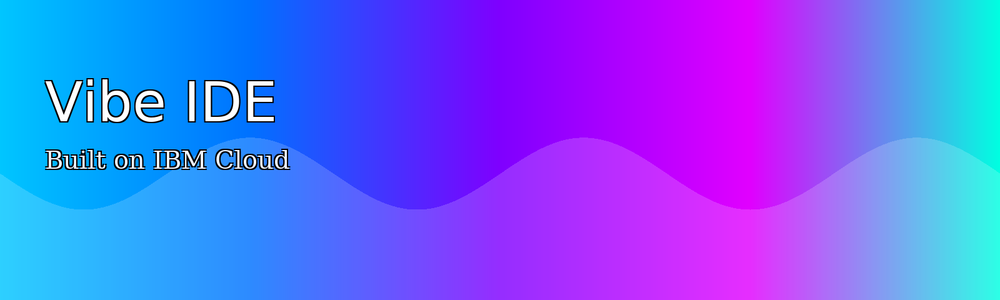

# 🌀 Vibe IDE — One-Click Cloud Publishing

**Deploy, edit, and publish your own vibe-coded web app — instantly.**

Built on **IBM Cloud Object Storage**, **Code Engine**, and **App ID**, the Vibe IDE deployable architecture gives you a live, browser-based IDE that can securely publish updates straight to your cloud bucket.



## ✨ Features
- **Full Vibe IDE frontend** — edit live HTML, preview instantly, and export or publish in one click.  
- **Secure broker backend** — powered by IBM Cloud Code Engine, rate-limited and App ID-protected.  
- **Zero-input Terraform** — deploys all required services automatically: COS, App ID, Code Engine, IAM bindings.  
- **Developer-friendly outputs** — URLs appear automatically in your Project’s Outputs tab.  

## 🛠️ Architecture
```
[Browser: Vibe IDE] → [App ID Auth] → [Code Engine Broker] → [COS Bucket (index.html)]
```
- **COS** hosts your live site.  
- **Code Engine** securely accepts publish requests.  
- **App ID** protects your endpoint.  
- **Terraform** wires everything together.

## 🚀 Quick Start (Static)
Open `index.html` — IBM Plex fonts load from the web, gradient UI is static, and the IDE runs fully client-side.  
To enable **Push to Cloud**, set `window.__VIBE_ENV__.PUSH_API_URL` in `assets/env.js` to your Code Engine `/publish` endpoint.

## 📚 Branding
_IBM Plex Sans_ for UI & headings, _IBM Plex Serif_ (light) for captions, _IBM Plex Mono_ for code.  
Co-brand: **Vibe IDE — Built on IBM Cloud**.
